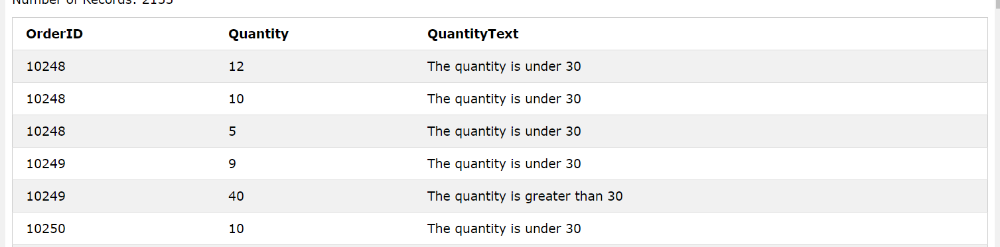

# Sql CASE

case关键语句可用于根据**字段的值**再基于自己定义的一套入口判断，返回(生成)出自己所总结的**特征**字段或则**普通字段**

```sql
CASE
    WHEN condition1 THEN result1
    WHEN condition2 THEN result2
    WHEN conditionN THEN resultN
    ELSE result
END;
```

每个`WHEN`后接字段的判断条件，`THEN`后面接结果，要是命中则返回给result，如果没有过`ELSE`关键字且要是没有命中前面的条件结果则返回`NULL`

----------------------

### 案例：从OrderDetails表中查询出订单ID，数量，数量特征(CASE生成)

```sql
SELECT OrderID, Quantity,
CASE
    WHEN Quantity > 30 THEN 'The quantity is greater than 30'
    WHEN Quantity = 30 THEN 'The quantity is 30'
    ELSE 'The quantity is under 30'
END AS QuantityText
FROM OrderDetails;
```



### 案例： 从Customers中查询CustomerName, City, Country，由City字段排序(如果为空则用Country排序)

```sql
SELECT CustomerName, City, Country
FROM Customers
ORDER BY
(CASE
    WHEN City IS NULL THEN Country
    ELSE City
END);
```
