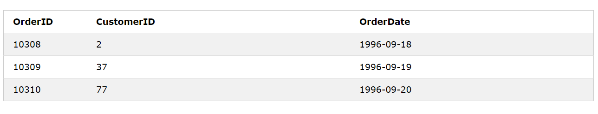
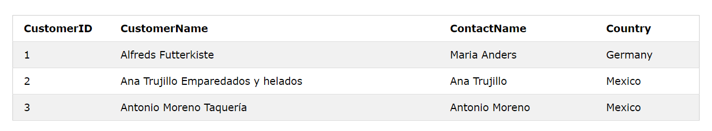
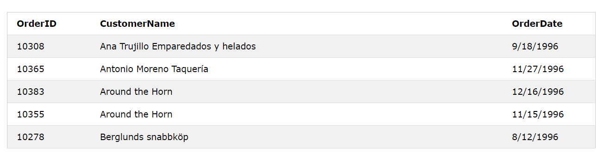
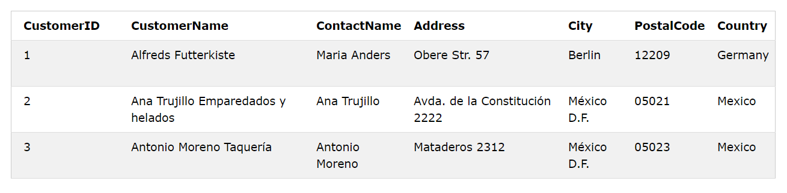

# sql-Join学习

## INNER-Join操作符

定义:INNER JOIN关键字选择两个表中具有匹配值的记录。

有如下两张表：订单表与消费者表





现在需要提取订单order表，并且基于里面的CustomerID用这个字段与Customer(消费者信息表)中的主键CustomerID关联起来，提取更多的信息

```sql
SELECT Orders.OrderID, Customers.CustomerName, Orders.OrderDate
FROM Orders
INNER JOIN Customers ON Orders.CustomerID=Customers.CustomerID;
```

结果展示:



## LEFT-Join操作符

定义：LEFT JOIN关键字从左表（表1）返回所有记录，并从右表（表2）返回匹配的记录。如果不匹配，则结果从右侧为NULL。

## RIGHT-Join操作符

定义：RIGHT JOIN关键字返回右表（表2）中的所有记录，并返回左表（表1）中的匹配记录。如果没有匹配项，则结果从左侧开始为NULL。

## Full-Join操作

定义:当左（表1）或右（表2）表记录匹配时，FULL OUTER JOIN关键字返回所有记录。

```sql
SELECT column_name(s)
FROM table1
FULL OUTER JOIN table2
ON table1.column_name = table2.column_name
WHERE condition;
```

## Self-Join操作

定义：自我联接是常规联接，表与其自身联接

```sql
SELECT column_name(s)
FROM table1 T1, table1 T2
WHERE condition;
```

演示：以下是Customers的表，存储了相关的信息



操作：提取所有customer，条件是他们来着同一个城市(迷之操作？？)

```sql
SELECT A.CustomerName AS CustomerName1, B.CustomerName AS CustomerName2, A.City
FROM Customers A, Customers B
WHERE A.CustomerID <> B.CustomerID
AND A.City = B.City
ORDER BY A.City;
```
