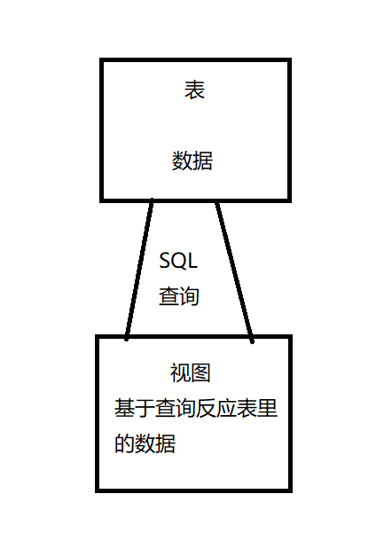

# 数据库视图

视图是一个虚拟表，对于用户来说，视图在外观和行为上都类似表，但它不需要实际的物理存储。视图实际上是由预定义查询形式的表所组成的。

当创建一个视图时，实际上是在数据库里执行了一个SELECT语句，它定义了这个视图。这个SELECT语句可能只包含表里的字段名称，也可以包含各种函数和运算来操作或汇总给用户显示的数据。



--------------------

创建视图的最简单方式就是基于单个表的全部内容

```sql
CREATE VIEW CUSTOMERS_VIEW AS
SELECT *
FROM CUSTOMER_TAB;

# 选择指定字段，减少视图里的内容
CREATE VIEW EMP_VIEW AS
SELECT LAST_NAME, FIRST_NAME, MIDDLE_NAME
FROM EMPLOYEE_TBL;

# 
```
