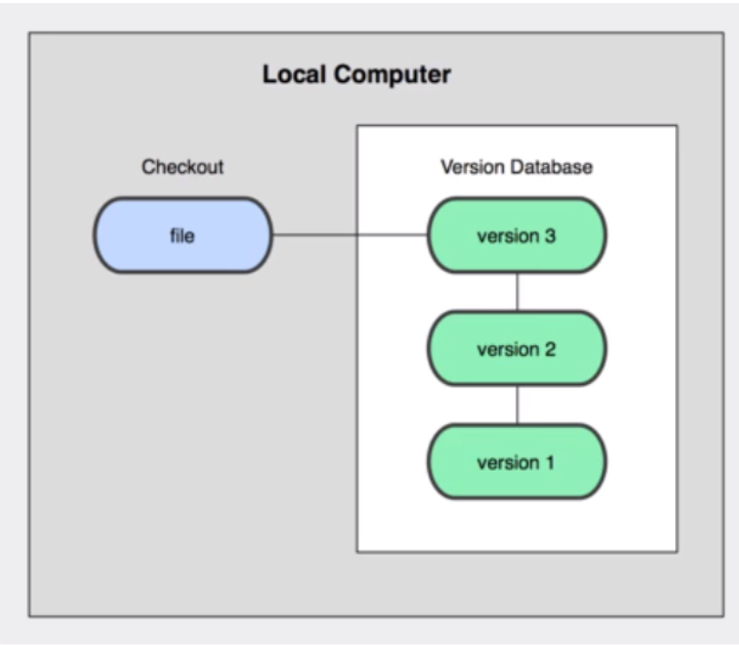
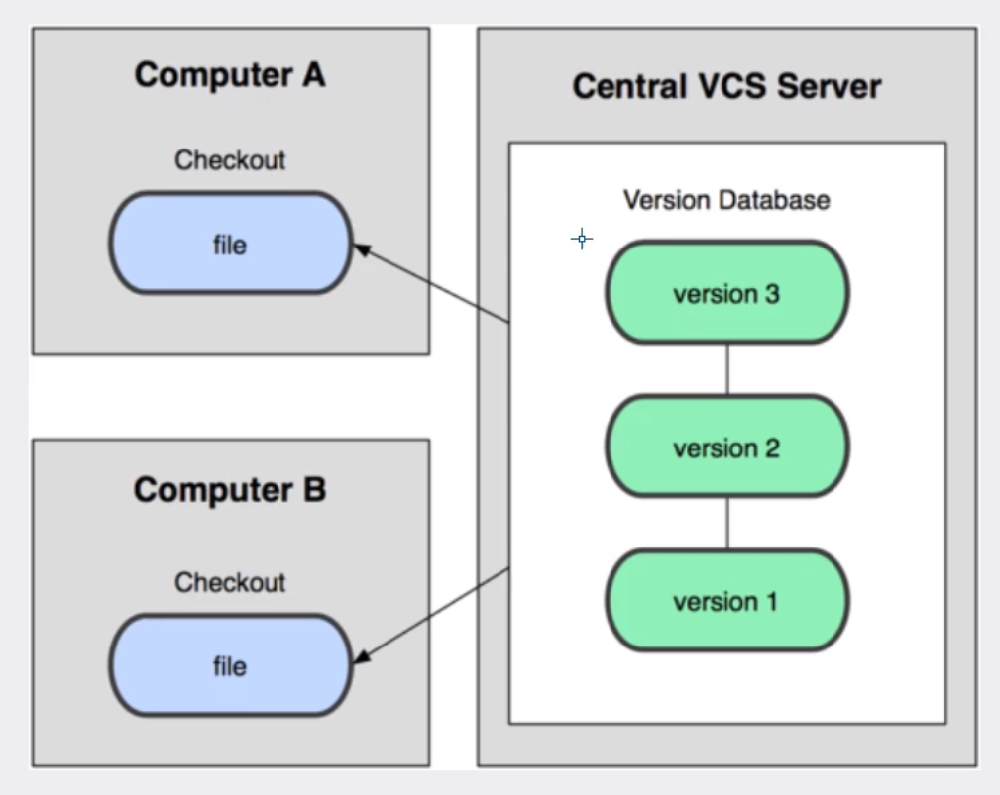
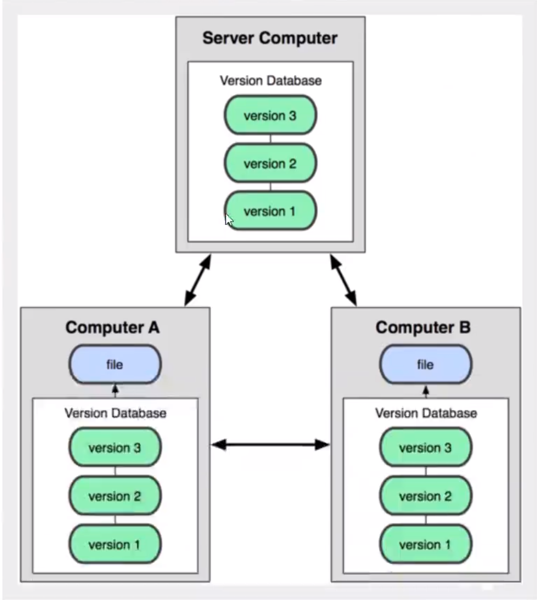

# 版本控制

版本控制(Revision control)是一种在卡法过程中用于管理我们对文件、目录或工程等内容的修改历史，方便查看更改历史记录，备份以便回复以前的版本的软件工程技术。

* 实现跨区域多人协同开发

* 追踪和记载一个或者多个文件的历史记录

* 组织和保护你的源代码和文档

* 统计工作量

* 并行开发，提高开发效率

* 跟踪记录整个软件开发的过程

* 减轻开发人员的负担，节省时间，同时降低人为错误

目前主流的版本控制工具有以下两个分别是SVN跟GIT。

> 版本控制分类

#### 1.本地版本控制

记录文件的每次更行，可以对每个版本做一个快照，或是记录补丁文件，适合个人用，如RCS。

#### 1.集中版本控制

所有的版本数据都保持在服务器上，协同开发者从服务器上同步更新或上传自己的修改

所有的版本数据都存在服务器上，用户的本地只有自己以前所同步的版本，如果不连网的话，用户就看不到历史版本，也无法切换版本验证问题，或在不同分支工作。而且，所有的数据都保存在单一的服务器上，有很大的风险就是这个服务器会损坏，这样就会丢失所有的数据，当让也可以定期备份。代表参评：SVN、CSV、VSS

#### 分布式版本控制

所有版本信息仓库都会同步到本地的每个用户，这样就可以在本地查看所有历史版本，可以离线在本地提交，只需要在连网时push到相应的服务器或其他用户哪里。由于每个用户那里都是所有的版本数据，只要有一个用户的设备没有问题就可以恢复所有的数据，但这郑家了本地存储空间的占用

> GIT与SVN的主要区别

**SVN**是集中式版本控制系统，版本库是集中放在中央服务器的，而工作的时候，用的都是自己的电脑，所以首先要从中央服务器得到罪行的版本，然后工作，完成工作后，需要把自己做完的活推送到中央服务器。集中式版本控制系统必须联网才能工作，对网络代换要求较高。

Git是分布式版本控制系统，没有中央服务器，每个人的电脑就是一个完整的版本库，工作的时候不需要联网，因为版本都在自己电脑上。协同的方法是这样的：比如说自己在电脑上改了文件A，其他人也在电脑改了文件A，这时，只需要把各自的修改推送给对方，就可以互相看到对方的修改了。

