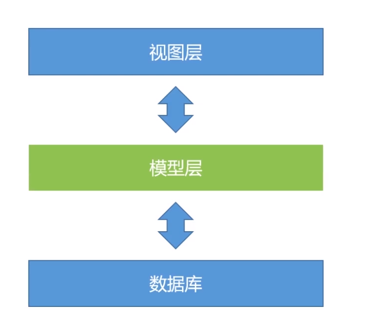

# Django模型层

### 概述：

开发后台应用免不得设计数据交互，传统得方式是使用SQL进行数据库查询获取数据，在Django中通过ORM(object relation model)模型来操控与底层数据库的交互。



模型层位于Django视图层和数据库之间，使用python对象和数据表进行转换

> 模型层相关的配置

在setting.py中配置模型层

```python
# setting.py


# Database
# https://docs.djangoproject.com/en/2.2/ref/settings/#databases

DATABASES = {
    'default': {
        'ENGINE': 'django.db.backends.sqlite3',
        'NAME': os.path.join(BASE_DIR, 'db.sqlite3'),
    }
}
```
