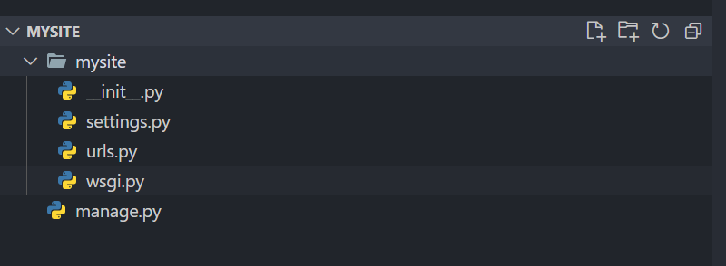

# 1.1 django相关基础

Django常用的基本命令

| 命令             | 说明                        |
| -------------- |:------------------------- |
| startproject   | 创建一个django项目              |
| startp         | 创建一个django应用              |
| check          | 检查项目完整性                   |
| runserver      | 本地简易运行django项目            |
| shell          | 进入django项目的python shell环境 |
| test           | 执行django用例测试              |
| makemigrations | 创建模型变更的迁移文件               |
| migrate        | 向上一个命令创建的迁移变更到数据库中        |
| dumpdata       | 把数据库数据导出到文件               |
| loaddata       | 把文件数据导入到数据库               |

使用django-admin startproject [projectname]创建django项目，项目目录如下所述

> 项目目录介绍

* 项目配置文件：settings.py

* 项目路由配置文件：urls.py

* 项目管理文件：manage.py
