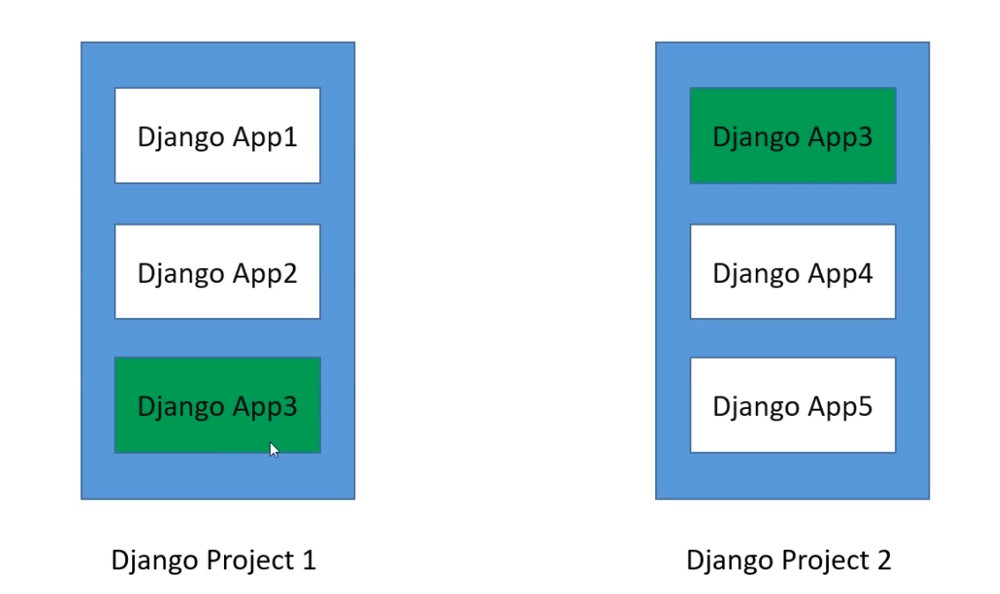

# 1.2 Django应用说明

### 概念：

* 一个Django项目就是一个基于Django的Web应用

* 一个Django应用就是一个可重用的Python软件包

使用`startproject`创建出来的为django项目，使用`startapp`创建出来的为django应用。一个项目会包含多个应用，之间为一对多关系，**一个Django项目包含一组配置和若干个Django应用** 



如下命令创建应用：

```python
python manage.py startapp [appname]
```

每个应用可以自己管理模型，视图，模板，路由和静态文件等。


| 文件名                  | 作用               |
| -------------------- | ---------------- |
| views.py             | 视图处理的地方          |
| models.py            | 定义应用模型的地方        |
| admin.py             | 定义Admin模块管理对象的地方 |
| apps.py              | 应用声明的地方          |
| tests.py             | 编写应用测试用例的地方      |
| <mark>urls.py</mark> | (自行创建) 管理应用路由的地方 |
