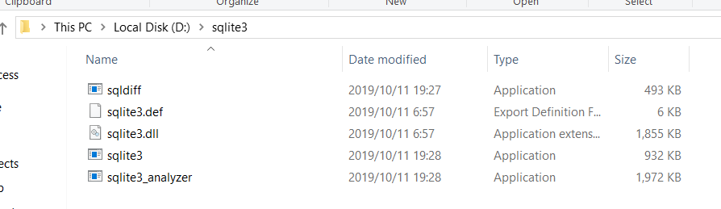
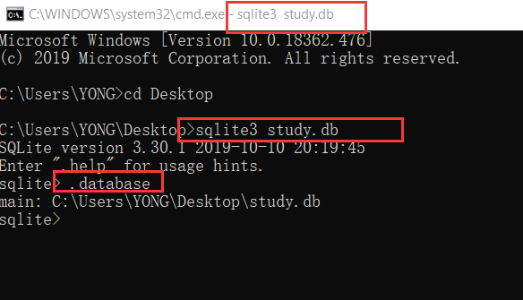

# orm相关

使用orm来进行管理数据库，在python中SQLAlchemy是最为广泛使用的，扩展FLASK-SQLAlchemy集成了SQLAlchemy，我们使用该插件进行数据库Model的定义。

`pip install pip install flask-sqlalchemy`

**使用sqlite3作为简易的数据库进行演示**

> ### Sqlite3安装:
> 
> win平台:
> 
>     下载以下两个文件,解压到你喜欢的目录，并把该目录添加到环境变量方便初始化。
> 
> 
> 
> 
> 
> linux平台:
> 
>     几乎所有版本的Linux都自带SQLite
> 
> ### Sqlite3创建初始数据库db文件
> 
> 在cmd下使用命令`sqlite3 xxx.db`会在当前目录下创建db文件,并且使用`. databases`检查它是否在数据库列表中)
> 
> 

