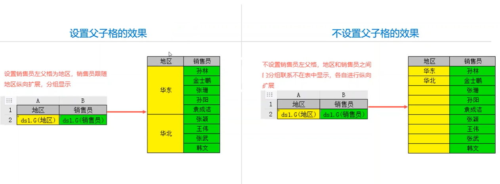
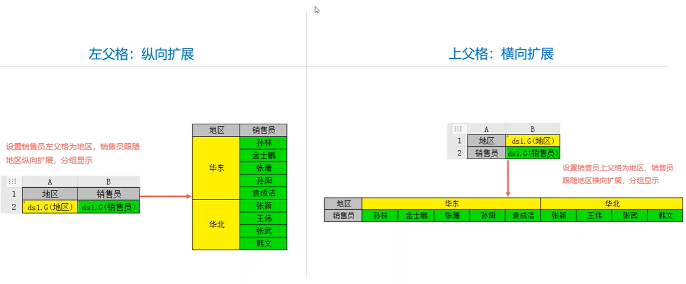
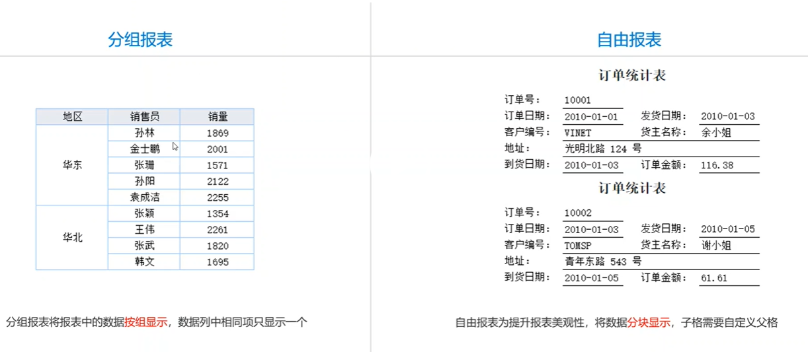
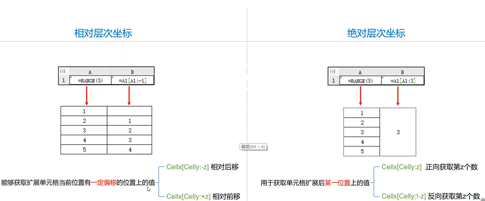
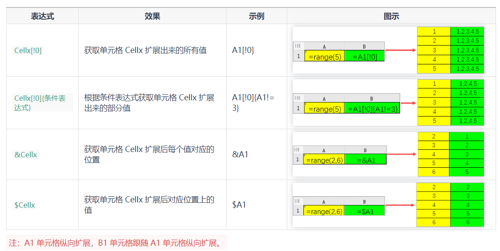
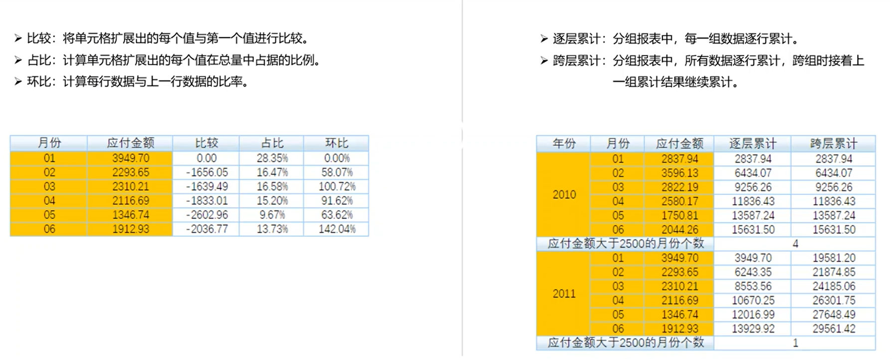

# 父子格设置

概念： 子单元格设置父单元格后，子单元跟随父单元进行单元格扩展。简单来说，子单元格根据父单元格分组显示

父子格分如下类型

## 父子格设置： 分组报表 & 自由报表

## 层次坐标
概念: 扩展单元格运算时需要使用层次坐标来表示单元格扩展后的表格位置

以下是使用层次坐标，常用的公式
     

### 动态格间运算
概念:使用层次坐标进行跨行运算、跨组运算、集合运算等等
