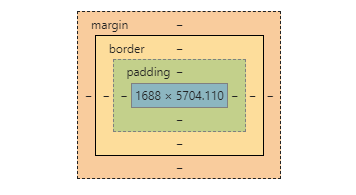

# 我对Css的理解

## 0- 前言

对之前关于CSS做的基本无用的笔记的一个总结，并且再也不记录一些标签Css的用法，之前跟着网上的前端视频对其进行学习，几乎都是从很多的html标签中慢慢的挑出来，单独讲解改变或修改xxx属性然后在浏览器上展示，个人觉得十分浪费时间，以下是一些关于我自己的理解。

## 1- 简述

Css为样式叠成表，用于修饰html的样式，其真正发挥作用必须要基于浏览器的渲染功能，所以CSS的定义(语法)与浏览器是相辅相成的。在某些老旧的浏览器中如果你的编写的Css过于新颖(对于其要修饰的标签的语法支持)会导致识别不出来。

## 2- 关键

html是由一个一个的标签组成并且都是呈一定结构组合(具体为什么组成这样结构只有该网页的开发人员知道)，我们知道Css是修饰html标签的样式，所以会有**选择器**(selector)这一说法，选择器基于CSS所定义的语法用于**标志**当前要修饰的元素，选择之后，对齐进行具体样式的定义(比如定义颜色，当前元素的大小...)

对！ 我个人觉得Css最关键的是选择的使用(作为不是专业开发前端的人员来说)，而具体针对xx元素定制其xx样式，这其中的道理其实就是通过Css语法标志该xx元素，并且修改并定义其XX属性，而这里面的xx属性，有很多种，比如说元素的长(width)、宽(height)...具体有什么可以供你定制修改的属性我们可以上网查（Mdn， W3School）。

### 3- 个人建议

Css文件的引入仓用有三种方式，一般使用第三方lin的引入方式，当发生样式冲突时，浏览器会根据一个权重表进行选择

至少要去学习各种Css的选择器的基本使用，而具体标签的相关样式这些可以通过网上资料查找的方式去了解，因为内容太多，要记住全部基本不可能，最多能够对于几个常用的能够熟悉。

或许扽多人都困惑关于一个叫**盒模型**的东西 什么margin 什么 padding，虽然视频里老师又拿个箱子出来又在里面装个玻璃杯什么的尝试解释，但是其实还是很玄乎是吧。

我的解答：学会使用审查元素（观察具体元素在审查元素中的展现，那个有关标注的长方形，结合相关资料进行倒腾），针对其样式具体改进。

于其花时间看视频里面的老湿一个一个演示给你看，不如自己上网找demo更好！

## Final- 我的自问自答

杠！ ：我个人觉得Css最关键的是选择的使用(作为不是专业开发前端的人员来说)？？？ 

答：随便打开一个网站，其组成以及内容页面的跳转，无不包含许多的html、css与JS。当同一个项目中有10几个html内容时，对于编写CSS肯定是一个极大的考验，比如用类选择器，id选择器...一不留神可能就极容易混乱

## 叨叨：

我浏览课视频程后面有讲到什么布局设计，点进去快速的瞄了一下，什么 双飞翼布局，圣杯布局..., 都是些挺玄乎的东西，结合我自己的倒腾以及理解，一切网站页面的设计具体理论上在企业中都应该会有美工吧？，利用photoshop..之类的工具做出一张网页最后的雏形图，前端工程师根据这个图进行代码的编写，或许会针对其特定性用XX布局什么的，但是这些不是美工都给你布局好了么？？

