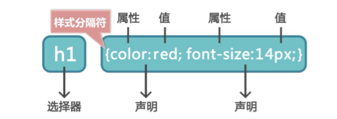
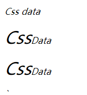
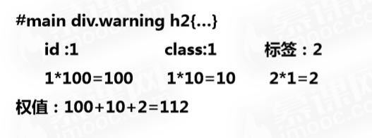

## Css基础

css层叠样式表(Cascading style sheets)用于定义HTML内容在浏览器内的显示样式,如今css已经发展到css3，如今主流浏览器都兼容css3语法以及许多前端页面的样式都是使用css3进行装饰。

>  Q: CSS的意义
> 
>  A: 1- Css间话HTML相关标签，网页体积小，下载快; 2- 解决内容与表现分离的问题 3- 更好的维护网页，提高工作效率

### 如何使用Css

有如下4种方式引入Css生效

| 类型                 | 引入方法                | 位置                | 加载              |
| ------------------ | ------------------- | ----------------- | --------------- |
| 行内样式               | 标签内定义style属性        | html文件内           | 同时              |
| 内部样式               | `<head>`中`<style>`内 | html文件内           | 同时              |
| 外部样式(**常用**)       | `<head>`中`<link>`内  | .css样式文件与html文件分离 | 页面加载时，同时加载Css样式 |
| 导入时@import(**鸡肋**) | 在样式代码最开始从           | .css样式文件与html文件分离 | 在读取玩html文件之后加载  |

演示demo

```html

<html>
    <head>
        <!--css内部样式-->
        <style type="text/css">
            样式...
        </style>
        <!--引入外部样式-->
        <link href="xxx.css" rel="stylesheet" type="text/css"/>
    </head>
    <body>
        <!--行内样式-->
        <p style="color:red;">xxx</p>
    </body>
</html>
```

### Css的内容

css规则由两部分构成: **构成**，**声明**



#### 选择器

选择器用来定位html中的元素, 有如下选择器

* 类选择器
  
  * > 为html标签添加class属性
    > 
    > ```html
    > <h1 class="red">HeadLine1</h1>
    > <p>somethings</p>
    > <p class="red">somethings red</p>
    > <h2 class="red fsize">HeadLine2</h2>
    > ```
    > 
    > 通过类选择器来为具有此class属性的元素设置CSS样式
    > 
    > ```css
    > .red{
    >     color:red;
    > }
    > ```
    > 
    > 可对不同类型元素的同一个名称的类选择器设置不同的样式规则
    > 
    > ```css
    > p.red{font-size:18px;}
    > h1.red{font-size:20px;}
    > ```
    > 
    > html可以中元素可以定义多个类,需要用空格隔开，在CSS中使用类选择选择如下
    > 
    > ```css
    > h2.red.fsize{
    >     color:red;
    >     font-size:25px;
    > }
    > ```

* 标签选择器
  
  * > 以HTML标签作为选择器
    > 
    > ```css
    > p,h1,h2,h3,h4{ font-size:30px;}
    > p{color:blue;}
    > h1{color:red}
    > ```
    > 
    > 这样设置样式会全局生效，一次同一规定了本次html中的p,h,h1,h3,h4标签的字体大小同为30px, 接下来同样是使用标签选择器，单独定义了全局p标签h1标签的字体颜色

* ID选择器
  
  * > id在html中具有唯一性，通过id选择器定位html标签
    > 
    > ```html
    > <h1 id="title">HeadLine1</h1>
    > ```
    > 
    > ID选择器用`# + id名`定位标签
    > 
    > ```css
    > #title{
    >     font-size:18;
    > }
    > ```

* 群组选择器
  
  * > 集体同一设置样式:
    > 
    > ```css
    > h1,h2,h3{
    >     color:blue;
    > }
    > ```

* 全局选择器
  
  * > 所有标签设置样式
    > 
    > ```css
    > *{
    >     color:blue;
    >     ...
    > }
    > ```

* 后代选择器
  
  * > 在html中标签之间有嵌套关系，通过如下的方法定位标签
    > 
    > html如下：
    > 
    > ```html
    > <em>Css data<em>
    > <p><em>Css</em>Data</p>
    > <p><em>Css</em>Data</p>
    > ```
    > 
    > 定位p标签下的em标签，修改其字体大小
    > 
    > ```css
    > /* 元素之间的嵌套使用空格定位 */
    > p em{
    >     font-size:30px;
    > }
    > /* 上述定位方式，会使所有p标签下有em标签的内容样式发送变化 */
    > 
    > /* 结合类选择器 id选择器 可以更好的定位 */
    > p a em{....}
    > #p1 em{....}
    > p.red a em{....}
    > ```
    > 
    > 
    
    关于定位器的使用Tip: **id不要滥用，谨慎使用，适当使用class**

--------------------------------------

**CSS中的伪类**

有如下伪类定义可以触发更加生动的Css样式

| 伪类      | 说明                          |
| ------- | --------------------------- |
| :hover  | 鼠标悬停经过某个元素                  |
| :action | 用于一个元素被激活时(即按下鼠标后放开鼠标之前的时间) |

Demo: 定义一个p标签，字体默认黑色 ，鼠标经过时变成红色，点击时变成蓝色

```html
<p>this is a word</p>
```

```css
p:hover{
    color:red;
}
p:active{
    color:blue;
}
```

> 针对于html中的**a标签**由于其作用是点击后跳转链接，它会额外多出2中伪类状态
> 
> | 伪类（a-tag） | 说明     |
> | --------- | ------ |
> | :link     | 未访问的链接 |
> | :visited  | 已访问的链接 |
> 
> Tips: 链接伪类的顺序
> 
> :link >&nbsp; :visited >&nbsp; :Hover >&nbsp;:active
> 
> 1:&nbsp;a:hover必须置于a:link和a:vivited之后，才有效
> 
> 2:&nbsp;a:active必须置于a:hover之后才有效
> 
> 3:&nbsp;伪类名称对大小写不敏感

-----------------------------

#### Css优先级

在htm中标签会从父元素继承部分CSS属性,  每个标签都一颗定义多个样式。

* 不冲突时,多个样式可叠成为一个

* 冲突时，按不同样式规则优先级来应用样式

##### Css使用方法优先级（发生冲突）

行内样式>内部样式>外部样式

> Tips: 链入外部样式表与内部样式表之间的优先级取决于所处位置的先后；最后定义的优先级最高(就近原则)

同一样式表中:

1- 权值相同：采用就近原则(离被设置元素越近优先级越高)

2- 权值不同：根据全职来判断CSS样式，谁权值高就用谁

如下为选择器权值:

| 标签选择器     | 1    |
| --------- | ---- |
| 类选择器和伪类   | 10   |
| ID选择器     | 100  |
| 通配符(*)选择器 | 0    |
| 行内样式      | 1000 |

通过统计不同选择器的个数，每类选择器的个数乘以相应权值，最后相加得出当前选择器的权值, 如下：



#### 属性声明

css样式的命名

* 采用因为字母、数字以及"-"和"_"命名

* 以小写字母开头，**不能**以数字和"-","_"开头

* 命名形式：单字，连字符，下划线和驼峰

* 使用有意义的命名

----------------------

常用的Css样式命名

1)&nbsp;页面结构

| 页头: header            | 导航: nav                |
| --------------------- | ---------------------- |
| 页面主体: main            | 侧栏: sidebar            |
| 页尾: footer            | 栏目: column             |
| 内容: content/container | 页面外围控制: wrapper        |
| 容器: container         | 左右中: left right center |

2)&nbsp;导航

| 导航: nav      | 左导航:leftsidebar  |
| ------------ | ---------------- |
| 主导航: mainnav | 右导航:rightsidebar |
| 子导航: subnav  | 菜单: menu         |
| 顶导航: topnav  | 子菜单: submenu     |
| 边导航: sidebar | 标题: title        |
|              | 摘要: summary      |

3)&nbsp;功能

| 标志:logo       | 注册:register |
| ------------- | ----------- |
| 广告: banner    | 搜索: search  |
| 登陆: login     | 功能区: shop   |
| 登陆条: loginbar | 标题: title   |
