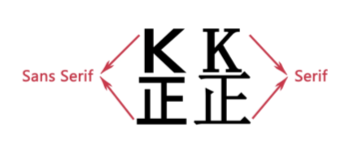
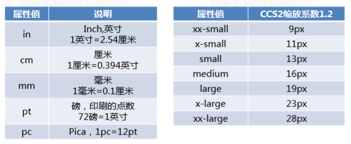
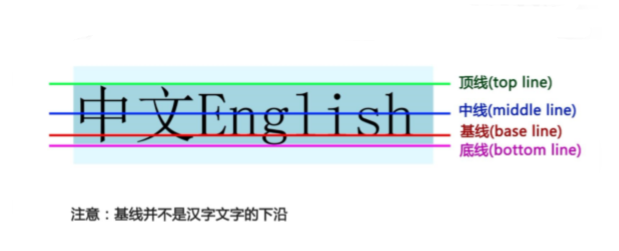
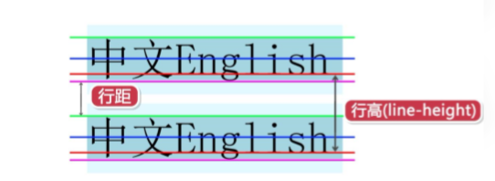
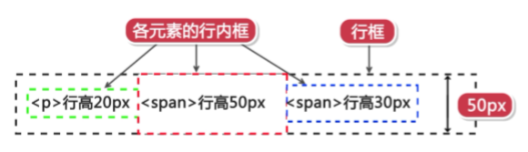

## Css 文本样式

网页中充斥着大量的字体，以下为字体样式相关内容。

### 文字:

关于文字的样式有颜色、字体大小、字体、加粗。

| 样式   | 属性          |
| ---- | ----------- |
| 字体   | font-family |
| 文字大小 | font-size   |
| 文字颜色 | font-color  |
| 文字粗细 | font-weight |
| 文字样式 | font-style  |

#### font-family字体属性

定义元素内文字以什么字体显示

语法:

`font-family:[字体1],[字体2],[...]`

说明：

* 含空格字体名和中文，用因为引号"括起

* 多个字体用逗号隔开

font-family属性值: 具体字体名，字体集

常见有如下字体集: Serif, Sans-serif, Monnospace, Cursive, Fantasy

```css
p {font-family: xxx, xx,xx}
```

> 补充sERIF和Sans-serif区别： 相对于Sans-Serif, Serif的字体会有勾脚，而Sans-Serif比较圆润平滑)
> 
> 

#### font-size文字大小

定义元素内文字大小

`font:绝对单位|相对单位`

绝对单位如下:



相对单位如下:

* px像素

* em | % 

#### color文字颜色

定义元素内文字颜色

语法: `color:颜色名|十六进制|RGB`

#### font-weight文字粗细

为元素内文字设置粗细

`font-weight:normal|bold|bolder|lighter|100~900`

说明：

默认值:normal

400等同于normal，而700等同于bold

......

### 文本:

大量的文字组成一段文本，关于文本的样式有行高、对齐方式、文本装饰。

#### text-align

设置原属内文本的水平对齐方式

`text-align: left | right | center | justify`

> Tips: 该属性对块级元素设置有效div、 p

#### vertical-align

设置元素内容的垂直方式

`vertical-align:baseline|sub|super|top|text-top|middle|bottom|text-bottom|`

#### line-height

设置元素中文本行高

`line-height: 长度|百分比`

一行文字的高度，行高指文本行的基线间的距离







补充:

[前端字体](http://www.fly63.com/article/detial/1114](http://www.fly63.com/article/detial/1114)
