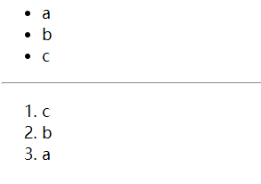
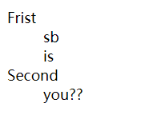

# Html简介

html(hyper text mark language)超文本标记语言，用于编写网页基本结构，结合CSS(样式叠成表)修饰其中html的元素，从而在浏览器中展示漂亮的静态页面。

html的基本骨架内容如下

```html
<html>
    <head>
        <title></title>
    </head>
    <body>
        ....
        
    </body>    

</html>
```

其内容组成由一对对由尖括号包裹的标签组成，根据其展现内容可以看出内容呈分层结构，其中html标签包裹head标签跟body标签，再者head标签与body标签下又包含其他元素内容。

根据MDN所述head标签的内容是不会展现在浏览器选然后的界面中的，浏览器会渲染body标签小的内容。head标签的内容用于声明一些meta元信息，引入静态CSS文件。

> TIp: html标签有的标签是单个tag的，即没有关闭/符号，比如img（插入图片）标签, br（换行）标签...

## 文档段落

在每次编写html的时候，在头部我们需要引入正确的doctype类型（以便浏览器能够正确辨识并引用其内置的渲染方式进行渲染，不同类型的doctype其渲染效果会不同）

在html文档第一行引入声明

```html
<!DOCTYPE html>
<html>
    ...
</html>
```

-----------------------------------

**tag-1：引入字符编码声明**

如果在html里写入中文需要在head标签里面声明当前html的字符集，使用meta标签进行声明，如下使用utf8字符集编码，常见的编码还有GBK，gb2123..主要还是使用utf8

```html
<meta charset="UTF-8">
```

--------------------------

### 段落标签

段落标签在浏览器渲染的时候会另起一行，就好比你写文档的时候回车换行,其内容会在新的一行中进行展现

* 标题标签(h1 -- h6)

> 标题，字体由大到小
> 
> ```html
> <h1>内容</h1>
> <h2>内容</h2>
> ```

* 段落标签(p)

> 在新的一行中，新建一个段落添加文字
> 
> ```html
> <p>......</p>
> <!-- 可以修改其align数据 对段落的对齐样式进行修改 -->
> <p align="left">左对齐内容</p>
> <p align="right">右对齐内容</p>
> <p align="centre">居中对齐内容</p>
> <p align="justify">对行进行伸张对齐，每行都会有相等的程度</p>
> ....
> ```

* 换行标签(br) ：进行换行

* 分割线标签(hr):  添加分割线

### 字体相关

一些标签定义字体的样式，可以修饰其内容样子

* 文字斜体: `<i></i>; <em></em>`

* 加粗: `<b></b>; <strong></strong>`

* 下标: `<sub></sud>`

* 上标: `<sup></sup>`

* 下划线:`<ins>`

* 删除线: `<del>`

### 特殊符号

我们知道在html中，里面元素的内容我们想要进行分割直接在里面输入空格在浏览器中是无法识别展示的。html中想要展示特殊的字符需要用如下进行代替

| 属性       | 结果    | 描述       |
| -------- | ----- | -------- |
| `&lt;`   | ＜     | 小于号或显示标记 |
| `&gt;`   | ＞     | 大于号或显示标记 |
| `&reg`   | ®     | 已注册      |
| `&copy`  | ©     | 版权       |
| `&trade` | ™     | 商标       |
| `&nbsp`  | Space | 不断行的空白   |

### 列表标签

使用列表标签进行多行数据元素的展示

* ul：定义无序列表，其子项都将由一个圆点进行标识

> ul中可以通过修改其tpye属性从而修改每个子项的标识(默认为小圆点)
> 
> 1:`<ul type="disc“></ul>` 圆点
> 
> 2:`<ul type="square"> </ul>` 正方形
> 
> 3:`<ul type="circule"></ul>`空心圆

* ol：定义有序列表，其子项都将由一个数据进行标识

> ol中可以通过修改其type属性从而修改每个子项的标识
> 
> 1:`<ol type="1"></ol>` 数字1, 2...
> 
> 2:`<ol type="a"></ol>`小写字母a, b...
> 
> 3:`<ol type="A"></ol>`大写字母A, B...
> 
> 4:`<ol type="i"></ol>`小写罗马数字i...
> 
> 5:`<ol type="I"></ol>`大写罗马数字I...

* li：作为以上ul，ol标签的每项的节点元素,展示每列内容

```html
    <ul>
        <li>a</li>
        <li>b</li>
        <li>c</li>
    </ul>

    <hr>

    <ol>
        <li>c</li>
        <li>b</li>
        <li>a</li>
    </ol>
```



* 定义列表（用得不多）：根据其层级会在页面中对齐内容进行自动内敛缩进,请注意该排放方式，以dl标签开始声明这个定义列表，接下来dt跟dd都是**同一级**的元素

```html
    <dl>
        <dt>Frist</dt>
        <dd>sb</dd>
        <dd>is</dd>
        <dt>Second</dt>
        <dd>you??</dd>
    </dl>
```



### 图像与超链接

* ``标签: 用于引入图片

> img中有如下的属性
> 
> | 属性      | 值          | 描述       |
> | ------- | ---------- | -------- |
> | src(比写) | URL(图片路径)  | 显示图像的URL |
> | alt     | 文字         | 图像代替文本   |
> | height  | 数字和百分比(px) | 图像的高     |
> | width   | 数值和百分比(px) | 图像的宽     |

* `<a></a>`标签：用于超连接跳转（打开新的网页）

> | 属性     | 描述                                   |
> | ------ | ------------------------------------ |
> | href   | 连接地址                                 |
> | target | 连接的目标窗口(_blank, _self, _top, parent) |
> | title  | 连接提示文字                               |
> | name   | 链接命名                                 |
> 
> 在同一页面中可以创造**锚点**使用a标签点击后进行跳转,方式如下
> 
> ```html
> <a href="#锚点1">目录1</a>
> <!-- 点击目录1后会跳转到锚点1中 -->
> <a href="#锚点2">目录2</a>
> 
> <a href="...", name="锚点1">内容</a>
> ......
> ......
> <a href="...", name="锚点2">内容</a>
> .....
> .....
> ```
