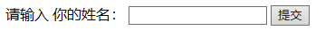
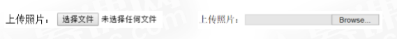

## Form表单

表单(Form)是 HTML 的一个重要部分，主要用于采集和提交用 户输入的信息。举个简单的例子，一个让用户输入姓名的 HTML 表单(Form)。

```html
<form action="#" method="get"> 

        请输入 你的姓名： <input type="text" name="yourname">
        <input type="submit" value="提交">
</form>
```



form标签作为包裹，里面的子标签为input，作为用户输入，最终由type为submit的输入框提交信息，以下为form标签中最关键的3个要点

### 1: 表单控件(form controls)

表单控件即为form标签内的内容，比如上面例子中的两个input框即为表单控件，通过修改input标签的type属性，定义不同的控件。

`<input>`标签的type属性：

| Type属性   | 描述   |
| -------- | ---- |
| text     | 文字域  |
| password | 密码域  |
| file     | 文件域  |
| checkbox | 复选框  |
| radio    | 单选域  |
| button   | 按钮   |
| submit   | 提交按钮 |
| reset    | 重置按钮 |
| hidden   | 隐藏域  |
| image    | 图像域  |

> **单行文本域**
> 
> ```html
> <form>
>  <input type="text" name="..." .../>
>  <input type="password" name="...".../> 
>  <!--密码域也是文本域的形式，输入到文本域的文字-->
> </form>
> ```
> 
> 可修改定义的属性
> 
> | 属性          | 描述                               |
> | ----------- | -------------------------------- |
> | name        | 文字域的名称                           |
> | maxlength   | 指用户输入的最大字符长度                     |
> | size        | 指定文本框的宽度，以字符个数为长度；文本框的缺省宽度为20个字符 |
> | value       | 指定文本框的默认值                        |
> | placeholder | 规定用户填写输入字段的提示                    |

---------------------

> **文件域**
> 
> ```html
> <input type="file" name="...">
> ```
> 
> 

--------------------

> **单选框**
> 
> 多项中选择一项(同一组name下)
> 
> ```html
> 男<input type="radio" name="sex" value="男">
> <br>

> 女<input type="radio" name="sex" value="女">
> ```

---------------------------

> **复选框**
> 
> 与单选框同样的到道理，在同组name下可以多选
> 
> ```html
> 唱<input type="checkbox" name="interest" value="sing">
> 跳<input type="checkbox" name="interest" value="dance">

> Rap<input type="checkbox" name="interest" value="rap">
> ```

---------

> **按钮**
> 
> form按钮，用于触发表单内的行为，submit用于提交，rest用于清空，button（可以用来自定义事件绑定）
> 
> ```html
> <input type="button" name="..." value="...">
> <input type="submit" name="..." value="...">
> <input type="rest" name="..." value="...">
> ```

-------------------

> **隐藏域**
> 
> 隐藏区域在浏览器中并不会渲染展示出来，但是它却真实存在html结构里面。
> 
> 使用场景： 在一些mvc框架中，由后台渲染html提交展示给用户，如果页面中有表单内容，为了防止csrf攻击，通常都会再该form内添加一个类型为hidden的input标签，其内容为一串标识串（用于后台验证当前表单是否合法），只有用户在渲染页面的时候才能获取，从而防止跨站脚本攻击。
> 
> ```html
> <input type="hidden" name="..." value="...">
> ```

表单控件除了上面的input标签还有如下:

| 标签           | 描述            |
| ------------ | ------------- |
| `<input>`    | 表单输入标签        |
| `<select>`   | 下拉菜单和列表标签     |
| `<option>`   | 下拉菜单和列表项目标签   |
| `<optgroup>` | 下拉菜单和列表项目分组标签 |
| `<textarea>` | 文字域标签         |

#### 下拉菜单和列表标签

```html
<select>
    <option value="...">选项</option>
    <option value="...">选项</option>
</select>
```

>  `<select>`标签属性
> 
> | 属性       | 描述           |
> | -------- | ------------ |
> | name     | 设置下拉菜单和列表的名称 |
> | multiple | 设置可选择多个选项    |
> | size     | 设置列表中可见选项的数目 |
> 
> `<option>标签属性`
> 
> | 属性       | 描述          |
> | -------- | ----------- |
> | selected | 设置选项初始选中状态  |
> | value    | 定义送往服务器的选项值 |

分组下拉菜单和列表标签的模板

```html
<select name="">
    <optgroup label=”goup_1“>
        <option value="...">选项</option>
        <option value="...">选项</option>
    </optgroup>
    <optgroup label=”goup_1“>
        <option value="...">选项</option>
        <option value="...">选项</option>
    </optgroup>
</select>
```

#### 多行文本域

`<textarea>`标签，用于输入长度较长的文本

| 属性          | 描述         |
| ----------- | ---------- |
| name        | 设置文本区的名称   |
| placeholder | 设置提示       |
| rows        | 设置文本去内可见行数 |
| cols        | 设置文本去内可见宽度 |

### 2: Action属性

上述介绍了form表单内常见的表单控件，接下来谈谈form本身的属性设置。要提交表单需要定义其action属性，值为需要提交的地址(URL)。 eg:

```html
<form action="http://www.xxxx.com/xxx.asp">
    ...
</form>
```

### 3: method属性

至于method，表示发送表单信息的方式。method有两个值： get和post。get的方式是将表单控件的name/value信息经过编码 之后，通过URL发送(你可以在地址栏里看到)。而post则将表单的 内容通过 http 发送，你在地址栏看不到表单的提交信息。那什么时 候用 get，什么时候用 post 呢？一般是这样来判断的，如果只是为 取得和显示数据，用get；一旦涉及数据的保存和更新，那么建议用 post

```html
<form action="http://www.xxxx.com/xxx.asp" method="get">
   ...
</form>
```

--------------

### Last: form标签的属性

| 属性      | 值                                                                 | 描述              |
| ------- | ----------------------------------------------------------------- | --------------- |
| action  | url                                                               | 提交表单时向何处发送表单数据  |
| method  | get、post                                                          | 设置表单以何种方式送到指定页面 |
| name    | form_name                                                         | 表单的名称           |
| target  | _blank、_self、_parent、_top                                         | 在何处打开action url |
| enctype | application/x-www-form-urlencoded、 multipart/form-data、text/plain | 发送表单数据之前对其进行编码  |

demo

```html
<form action="" method="get"> 
        请输入 你的姓名： <input type="text" name="yourname" placeholder="请输入用户名">
        <br>
        密码 <input type="password" name="password" placeholder="请输入密码">
        <br>
        上传图片<input type="file" name="上传图片">
        <br>
        男<input type="radio" name="sex" value="男">
        <br>
        女<input type="radio" name="sex" value="女">
        <br>
        <p>你的爱好</p>
        唱<input type="checkbox" name="interest" value="sing">
        跳<input type="checkbox" name="interest" value="dance">
        Rap<input type="checkbox" name="interest" value="rap">

        <select name="city">
            <optgroup label="佛山">
                <option value="shishan">狮山</option>
                <option value="guicheng">桂城</option>
            </optgroup>
            <optgroup label="广州">
                <option value="baiyun">白云</option>
                <option value="tianhe">天河</option>
            </optgroup>
           </select>
        <input type="submit" value="提交">
    </form>
```
