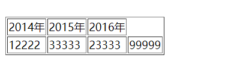
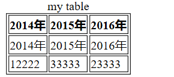
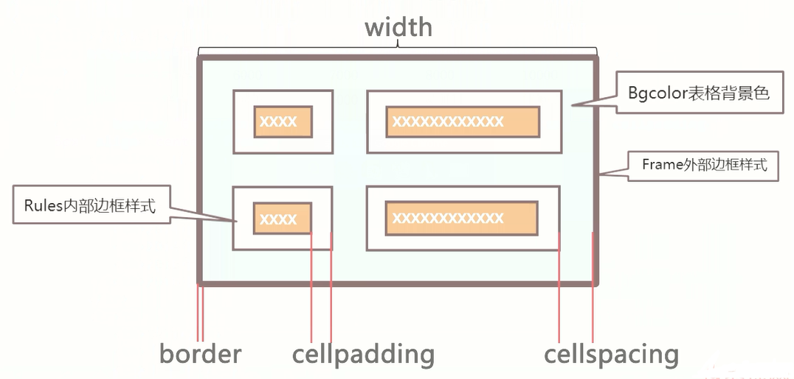
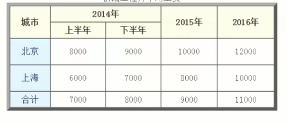

## Html常用表格

使用html创建一个表格, 表格在网页布局中起到了很大的作用，**通常用于数据的展示，购物单..**

```html
<table border="1">    <!--表格开始 添加bordar属性设为1即添加边框-->
    <tr>   <!--tr行标签-->
        <td></td>  <!--td单元格-->
        ...
    </tr>
    <tr>
         <td></td>
         ...
    </tr>
</table>
```

```html
 <table border="1" width="500px">  <!--设置width宽度-->
        <tr>
            <td>2014年</td>
            <td>2015年</td>
            <td>2016年</td>
        </tr>
        <tr>
            <td>12222</td>
            <td>33333</td>
            <td>23333</td>
            <td>99999</td>
        </tr>
    </table>
```



* ### 表格相关

`<th></th>`标签：用于声明表头，内容居中、加粗显示

`<caption></caption>`标签：用于声明表格的标题，必须紧随table标签后面

> ```html
> <table>
>     <caption>...<caption>
>     <tr>
>         <th>....</th>
>         <th>....</th>
>         ....
>     </tr>
>     <tr>
>         <td>...</td>
>         <td>...</td>
>     </tr>
> </table>
> ```

* ### 带结构的标签

表格划分三部分: 表头、主体、脚注

1. thead:表格的头（放标题之类的内容）
2. tbody:表格的主题（放数据主题）
3. tfoot:表格的角(放表格的脚注)

使用这种布局格式声明表头，身体，脚注的table表格，有利于浏览器的加载。

> ```html
> <table border="1">
>         <caption>my table</caption>
>         <thead>  <!--表头-->
>             <tr>
>                 <th>2014年</th>
>                 <th>2015年</th>
>                 <th>2016年</th>
>             </tr>
>         </thead>
>         <tbody>  <!--主题-->>
>             <tr>
>                 <td>2014年</td>
>                 <td>2015年</td>
>                 <td>2016年</td>
>             </tr>
>         </tbody>
> 
>         <tfoot>  <!--脚注--->>
>             <tr>
>                 <td>12222</td>
>                 <td>33333</td>
>                 <td>23333</td>
>             </tr>
>         </tfoot>
>     </table>
> ```



* ### 表格的属性

可以通过赋予`<table>`标签特定的属性，修改其样式

| 属性          | 值                                      | 描述              |
| ----------- | -------------------------------------- | --------------- |
| width       | pixels(px)、%                           | 规定表格的长度         |
| align       | letf、center、 right                     | 表格相对周围元素的对齐方式   |
| border      | pixels(px)                             | 规定表格边框的欢度       |
| bgcolor     | rgb(x,x,x)、#xxxxxx、colorname(red,blue) | 表格的背景颜色         |
| Cellpadding | px、%                                   | 单元边沿与其内容之间的空白   |
| cellspacing | px、%                                   | 单元格之间的空白        |
| frame       | 属性值                                    | 规定外侧边框的哪个部分是可见的 |
| rules       | 属性值                                    | 规定内侧边框哪个部分是可见的  |



> 补充 **frame**可定义的属性值如下
> 
> | 值      | 描述            |
> | ------ | ------------- |
> | void   | 不显示外侧边框       |
> | above  | 显示上部的外侧边框     |
> | below  | 显示下部的内侧边框     |
> | hsides | 显示上部和下部的外侧边框  |
> | vsides | 显示左边和右边的外侧边框  |
> | lhs    | 显示左边的外侧边框     |
> | rhs    | 显示右边的外侧边框     |
> | box    | 在所有四个边上显示外侧边框 |
> | border | 在所有四个边上显示内侧边框 |
> 
> 补充**rule**可定义的属性值如下
> 
> | 值      | 描述           |
> | ------ | ------------ |
> | none   | 没有线条         |
> | groups | 位于行组和列祖之间的线条 |
> | rows   | 位于行之间的线条     |
> | cols   | 位于列之间的线条     |
> | all    | 位于行于列之间的线条   |

* #### tr行标签的属性

| 属性      | 值                                         | 描述       |
| ------- | ----------------------------------------- | -------- |
| align   | left、center、right、justify、char            | 行内容水平对齐  |
| Valign  | top、middle、bottom、baseline、               | 行内容的垂直对齐 |
| bgcolor | rgb(x,x,x)、#xxxxxx、colorname(red,blue...) | 行的背景颜色   |

* #### thread、tbody、tfoot标签属性

这三个用于声明特定表的结构也有相同的属性，（倘若特定声明之后，其子项都会继承该规则）

| 属性     | 值                              | 描述      |
| ------ | ------------------------------ | ------- |
| align  | left,center,right,justify,char | 内容的水平对齐 |
| valign | top, middle,bottom,baseline    | 内容的垂直对齐 |

* ### 表格操作
  
  在基本表格上进行修改操作，创建嵌套表格，效果如下)
  
  
  
  > 对单元格进行合并, 定义其td属性，分别有跨行合并与跨列合并
  > 
  > ```html
  > <table>
  >      <tr>
  >          <td colspan="2">...<td>  <!--跨列合并-->
  >          <td>...</td>
  >          <td rowspan="2">...</td>  <!--跨行合并-->
  >      </tr>
  >      <tr>
  >          <td>...</td>
  >          <td>...</td>
  >          <td>...</td>
  >      </tr>
  > 
  > </table>
  > ```

```html
<!DOCTYPE html>
<html>
<head>
    <title>表格属性</title>
    <meta http-equiv="Content-Type" content="text/html; charset=utf-8" />
</head>
<body>    
     <!--创建2行3列表格 -->
     <table border="6" width="500px" bgcolor="#f2f2f2" cellspacing="0" cellpadding="5px" align="center" >
         <caption> 前端工程师平均工资</caption>
         <thead>
         <tr bgcolor="#d8e4bc">
            <th rowspan="2">城市</th>
            <th colspan="2">2014年</th>
            <th rowspan="2">2015年</th>
            <th rowspan="2">2016年</th>
         </tr>
         <tr bgcolor="#d8e4bc">
            <th>上半年</th>
            <th>下半年</th>
         </tr>
         </thead>

         <tbody align="center" valign="middle">
         <tr>
            <td bgcolor="#b8cce4" align="center" valign="middle">北京</td>
            <td>8000</td>
            <td>9000</td>
            <td>10000</td>
            <td>12000</td>          
         </tr>
         <tr>
            <td bgcolor="#b8cce4" align="center" valign="middle">上海</td>
            <td>6000</td>
            <td>7000</td>
            <td>8000</td>
            <td>10000</td>          
         </tr>
         </tbody>
         <tfoot>
         <tr align="center" valign="middle">
            <td height="30px" bgcolor="#b8cce4">合计</td>
            <td>7000</td>
            <td>8000</td>
            <td>9000</td>
            <td>11000</td>          
         </tr>
         </tfoot>
     </table>
</body>
</html>
```

### Last

* 尽量少的使用表格嵌套

* 尽量少的使用表格跨行跨类

说明：使用表格进行网页结构布局一般不设置border
